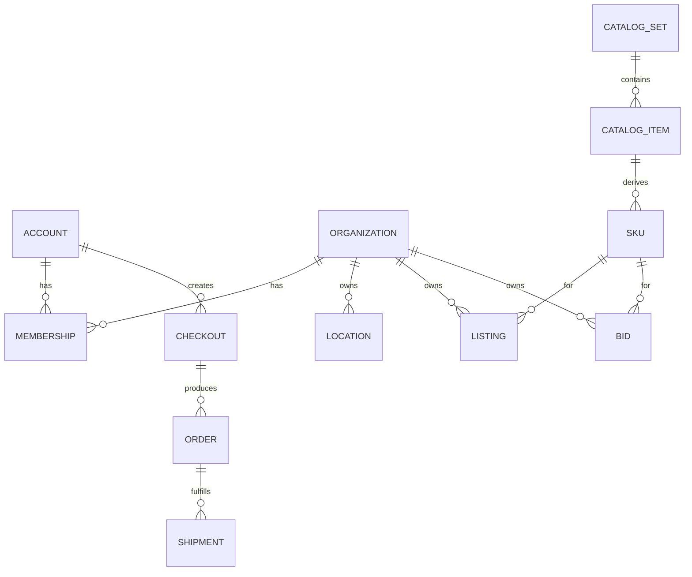

# 2.2 Domain Model & Ubiquitous Language

## Per-domain ubiquitous language (required)

This document is the **cross-domain** glossary.

Each domain must also define its own **Terminology & Definitions** (ubiquitous language) under:

- `domains/<domain>/docs/terminology-and-definitions.md`

Those per-domain terms should be used to model and name entities, commands, events, APIs, and projections. When a concept becomes shared across domains, reconcile it here.

## Glossary (canonical terms)

- **User**: a person who buys and/or sells on the marketplace.
- **Account**: a user identity with authentication, preferences, and marketplace permissions.
- **Organization**: a company/team container that can own listings, payment settings, and operational permissions.
- **Location**: a physical fulfillment origin for an Organization (warehouse/shop/kiosk). Locations can have their own inventory and fulfillment methods.
- **Membership**: a link between an Account and an Organization.
- **Role**: a named permission set within an Organization.
- **RBAC**: role-based access control to enforce what members can do.
- **API client**: any software client that calls the Chase Sets platform APIs (web app, partner integration, AI assistant/agent).
- **Delegated access**: an authorization grant where a user/org allows an external API client to act on their behalf with scoped permissions.
- **API key / token**: a credential used by an API client to authenticate; keys/tokens must be scoped, revocable, rotated, and audited.
- **Catalog**: the curated system-managed catalog of Pokémon TCG products.
- **Catalog Set**: an official Pokémon TCG expansion/set (e.g., “Base Set”, “Evolving Skies”).
- **Catalog Item**: a canonical product entry in the catalog.
  - Examples: a specific single card, a specific sealed product.
- **Item Form**: the high-level inventory form.
  - Admin-configured values (examples): **Conditioned** (raw/ungraded), **Sealed**, **Graded**.
- **Variant**: a specific distinguishable version of a catalog item.
  - Examples (MVP): language, foil/non-foil, edition/printing where relevant; for graded items: grading company + grade.
- **Variant Model**: the configuration template that defines allowed variant selection for a Catalog Item.
- **Variant Dimension**: a decision point in the selection flow (required/optional; single/multi select).
- **Variant Option**: a selectable value within a dimension (may reveal child dimensions).
- **Variant Path**: an ordered list of selected dimension-option pairs (validated against the Variant Model).
- **SKU (Sellable SKU)**: a unique sellable unit defined by `CatalogItem + VariantPath`.
- **Variant selector**: the UI workflow that guides a user to choose a valid VariantPath (and therefore SKU) for listing/offering/buying.
- **Condition**: the condition for raw singles.
  - Scale is admin-configured; MVP default example: **NM, LP, MP, HP, DMG**.
- **Grade**: a numeric/label grade for graded items (e.g., PSA 10).
  - Companies and grade scales are admin-configured; MVP default examples: **PSA, BGS, CGC**.
  - Grade encoding is typically modeled as two dimensions/facets (example): `company` + `gradeLabel`.
- **Listing**: a sell-side offer to sell a specific catalog item (and its attributes) at a price.
- **Bid**: a buy-side intent to buy a specific catalog item (and its attributes) at a price.
- **Order book**: the internal projection that represents the active bids and listings for a SKU.
- **Order**: a transaction created when a listing/bid results in a purchase.
- **Checkout**: a buyer purchase session that can include items from multiple sellers and may produce multiple Orders/Shipments.
- **Shipment**: a fulfillable unit with a single origin (location) and a tracking number; buyers may have multiple shipments per checkout.
- **Fulfillment**: the steps that move an order from paid → delivered.
  - MVP: ship-to-buyer only (pickup is explicitly out of MVP).
- **Inventory**: quantities/units of sellable SKUs owned by an Organization and tracked per Location.
- **Stock reservation**: a temporary hold on inventory units/quantity to prevent overselling during checkout and fulfillment.
- **Physical attributes**: dimensions (L/W/H) and weight for a SKU used to estimate shipping.
- **Shipping credit**: a credit equal to 5% of item value applied to shipping cost.
- **Balance**: a user-held on-platform balance that can be used to pay (free) or withdrawn via payout.

## UI terminology (retail-friendly)

We use exchange-like mechanics internally, but UI terminology should remain familiar to online shopping.

Recommended mapping (UI → internal):

- **Offer** (buyer) → `Bid`
- **Listing** or **For sale** (seller) → `Listing`
- **Market view** / **All listings & offers** → `OrderBook` (projection)
- **Offer accepted** / **Item sold** / **You bought it** → `TradeExecuted` / order created (internal events)

## Core relationships (first draft)

- Account (acting on behalf of an Organization) → creates Listings and Bids (offers in UI)
- Organization → owns Listings and Bids
- Organization → has Locations
- Location → holds Inventory
- Catalog Set → contains Catalog Items
- Catalog Item → has Variants
- Catalog Item → references a Variant Model
- Catalog Item + VariantPath → defines a SKU
- Listing/Bid → references exactly one SKU
- Listing/Bid → belongs to exactly one Order book / market view (defined by SKU)
- Order → references the listing/bid that resulted in the purchase + payment/fulfillment state

## Ambiguities / terms to resolve

- “Chase Sets” (brand/platform) vs “Catalog Set” (Pokémon expansion).
- Whether we need a first-class “Collection tracking” domain at all (explicitly out of MVP).
- What fields define a “variant” in Pokémon TCG for our use cases.

## Diagrams

---

## Questions to answer

## Open questions

1. What is the canonical identifier strategy for catalog items (set + card number; UPC for sealed; something else)?
2. What is the condition scale for singles (and does it vary by category)?
3. Which graders are supported (PSA/BGS/CGC/etc) and how we encode grade.
4. How is the Variant model represented in the catalog (schema) and how do we ensure it stays stable over time?
5. Are listings/bids strict SKU equality only (recommended for MVP), or do we allow equivalency rules later?
6. What organization roles do we need early (owner, admin, lister, finance, support)?
