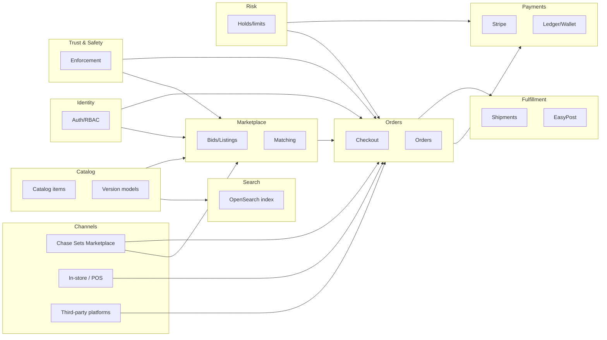

# 4.4 Domain Map & Integration Architecture (MVP)

## Why this doc exists

The repository already has:

- product vision and MVP scope
- a system architecture overview
- per-domain deep dives

This document is the missing bridge: it defines the **bounded contexts (domains)** we need for MVP and the **integration contracts** between them, at a level that is stable before code exists.

## MVP domains (bounded contexts)

### Catalog

- Curated catalog of items/sets
- Version model configuration + SKU resolution
- Catalog correction/audit workflow

### Search

- Indexing and query behavior (OpenSearch)
- Hybrid lexical + semantic posture (ADR 016)

### Marketplace

- Bids, listings, matching/execution
- SKU-level order books and price-time priority

### Orders (Checkout + Order lifecycle)

- Buyer **Checkout** session
- Seller-scoped **Order** lifecycle
- Orchestrates Payments + Fulfillment (state machine)

### Payments

- Stripe integration (card/ACH)
- Wallet/ledger projections + allocation
- Transfers/payouts/refunds/disputes

### Fulfillment

- Locations/inventory scope (ADR 015)
- Shipment creation, label purchase, tracking (EasyPost)

### Identity

- Auth/session, org accounts/RBAC
- Step-up auth and sensitive actions policy

### Risk

- Velocity limits, holds, payout gating hooks
- Checkout fraud/abuse controls

### Trust & Safety

- Reports, takedowns, suspensions
- Evidence handling and enforcement actions

## Cross-cutting capabilities (not separate domains yet)

These are MVP requirements, but we can keep them as cross-cutting capabilities rather than first-class bounded contexts initially:

- **Admin/support tooling** (see `artifacts/25-admin-support-tooling-and-operations.md`)
- **Notifications** (email/SMS/push): event-driven notifications for checkout/order/shipment/payment state changes
- **Analytics/telemetry**: product metrics instrumentation aligned to `artifacts/05-success-metrics-and-guardrails.md`
- **Channels/integrations** (adapters): additional sales channels (in-store, third-party platforms) over the same platform model (see [17-channels-and-integrations-architecture.md](17-channels-and-integrations-architecture.md)).

## Cross-cutting architectural rules

- **Event sourcing is the system of record** (ADR 005).
- Domains integrate primarily via **domain events**, with read models/projections for query.
- Side-effectful integrations (Stripe, EasyPost) must be replay-safe per the event store operability contract (ADR 018).
- All write APIs require a client-supplied **idempotency key** (`clientRequestId`).

## Context map (high-level)

## Core flow (event narrative)

1. Catalog publishes item + SKU facets → Search indexes.
2. Marketplace writes `BidPlaced` / `ListingCreated`.
3. Marketplace executes a trade → emits `MatchCreated` / `TradeExecuted`.
4. Orders consumes trade execution → emits `CheckoutCreated` + `OrderCreated`.
5. Orders requests Payments authorization/capture → Payments emits `PaymentAuthorized` / `PaymentCaptured`.
6. Orders requests Fulfillment shipments/labels → Fulfillment emits `ShipmentCreated` / `ShipmentLabelPurchased` / `ShipmentDelivered`.
7. Orders advances order state to completed; Payments releases proceeds per ledger/hold rules.

## Domain contracts (minimum stable payloads)

These are not full schemas—just the minimum that must be stable across domains.

### `TradeExecuted` (Marketplace → Orders)

Must include:

- `executionId` (globally unique)
- `buyerOrgId` / `buyerAccountId`
- `sellerOrgId`
- `skuId`, `quantity`, `unitPrice`
- references needed to compute fees/shipping policy inputs

### `CheckoutSubmitted` (Orders → Payments)

Must include:

- `checkoutId`
- totals breakdown (items, shipping, credits, fees, processing)
- per-seller allocation references (for ledger determinism)

### `OrderPaid` (Payments → Orders)

Must include:

- `checkoutId`
- payment processor references (Stripe IDs)
- allocation confirmation reference id(s)

### `ShipmentDelivered` (Fulfillment → Orders)

Must include:

- `shipment_id`, `order_id`, delivery timestamp/status

## Open questions (to resolve early)

- Stream keys and envelope contract (ADR 018).
- Order vs OrderIntent naming: this doc proposes **Orders owns Order/Checkout** and Marketplace emits `TradeExecuted`.
- Shipping quote timing and how it influences payment authorization sizing.
