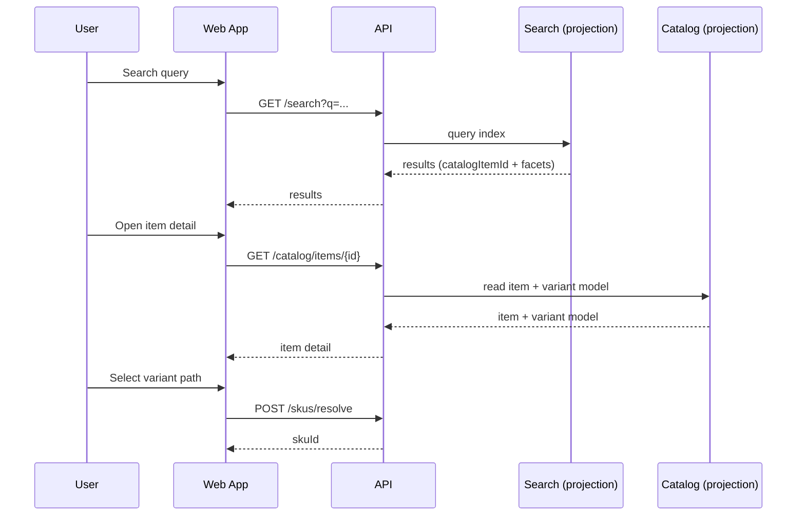
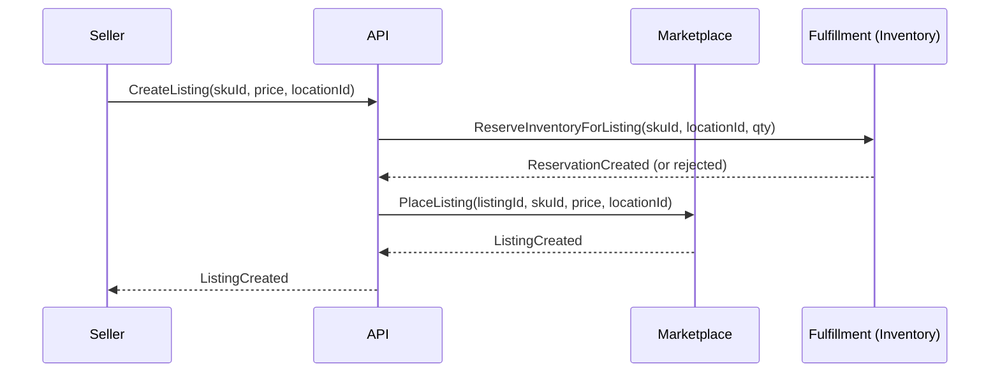
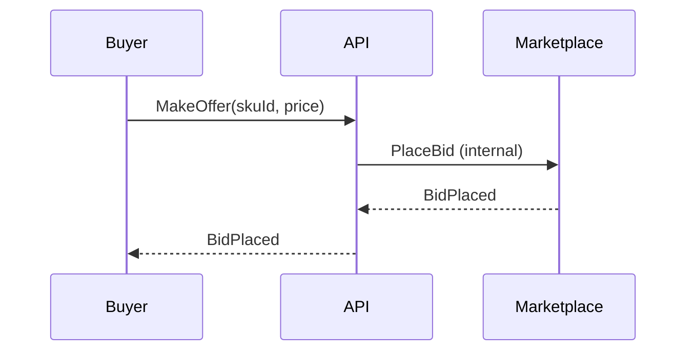
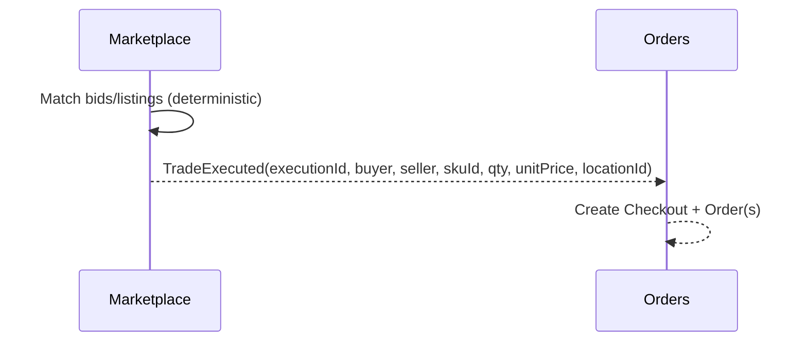
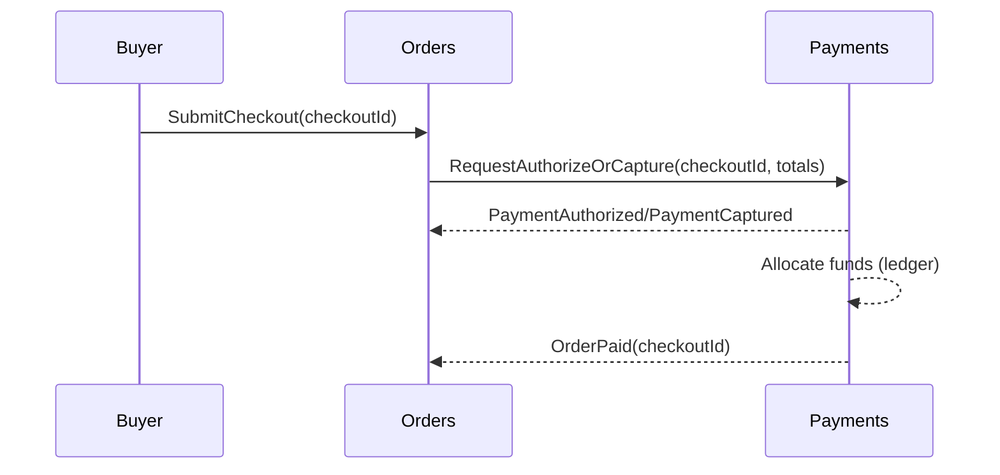
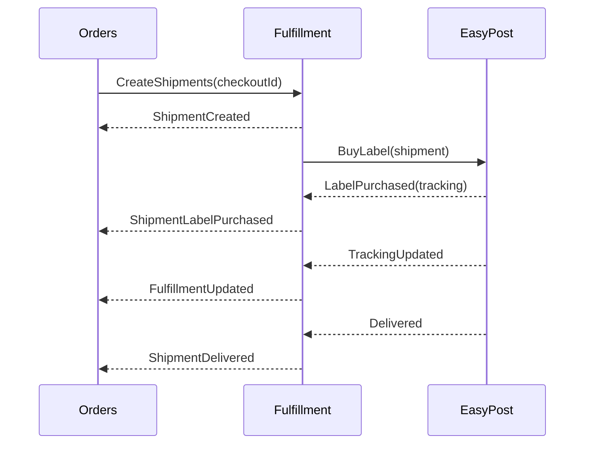
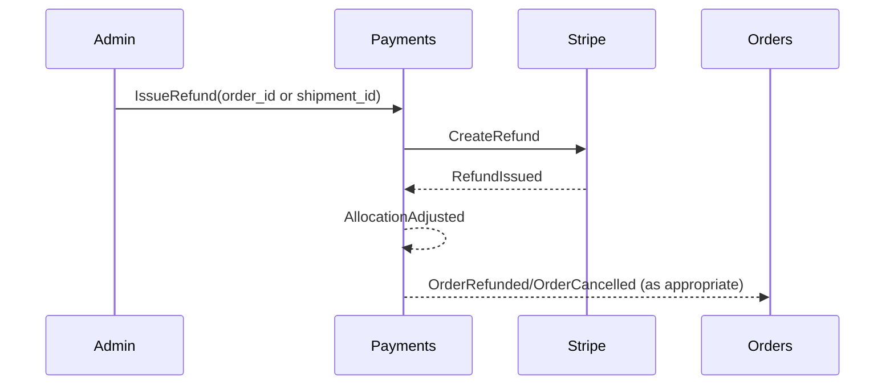

# 4.6 MVP Workflows & Event Flows (Doc-First)

## Why this doc exists

We have strong domain docs and ADRs. This document stitches them into **end-to-end workflows** so we can:

- confirm domain boundaries are correct
- confirm the required events/commands exist
- identify any remaining blockers before implementation

This is **documentation-only** and is expected to evolve as we validate ADRs.

## Canonical references

- System architecture: [04-system-architecture-overview.md](04-system-architecture-overview.md)
- Domain map: [15-domain-map-and-integration-architecture.md](15-domain-map-and-integration-architecture.md)
- Channels posture: [17-channels-and-integrations-architecture.md](17-channels-and-integrations-architecture.md)
- Data/event model: [09-data-and-event-model.md](09-data-and-event-model.md)

## Workflow index (MVP)

1. Catalog search → item detail → SKU resolution
2. Create listing (sell) with location-scoped inventory
3. Make offer (buy)
4. Match execution (buy-now/sell-now or crossing) → `TradeExecuted`
5. Checkout submit → payment auth/capture → ledger allocation
6. Shipment creation → label purchase → tracking → delivery
7. Refund/dispute unwind (admin + ledger)

---

## 1) Catalog search → item detail → SKU resolution

**Primary domains:** Catalog, Search

**Outcome:** user sees the correct CatalogItem and resolves a SKU deterministically.

**Notes / invariants**

- SKU resolution must be deterministic and stable for historical referential integrity.

---

## 2) Create listing (sell) with location-scoped inventory

**Primary domains:** Marketplace, Fulfillment (Inventory)

**Outcome:** a listing exists and is tied to a single fulfillment origin location.

Locked MVP policy:

- Reserve inventory at **listing time** for quantity-bound listings.
- Listings are **indefinite until canceled** (user/admin); no default expiry.

---

## 3) Make offer (buy)

**Primary domains:** Marketplace

**Outcome:** a buyer offer exists in the market for that SKU.

Locked MVP policy:

- No funds hold at offer creation.
- Funds hold/authorization happens at **checkout submit**.

---

## 4) Match execution → `TradeExecuted`

**Primary domains:** Marketplace → Orders

**Outcome:** a deterministic trade execution is created and handed off to Orders.

**Notes / invariants**

- Matching must be deterministic and auditable.
- `TradeExecuted` must be idempotent by `executionId`.

---

## 5) Checkout submit → payment auth/capture → ledger allocation

**Primary domains:** Orders, Payments

**Outcome:** buyer pays once per checkout; authorization is obtained at submit; allocation is recorded after capture; Orders advances to Paid.

**Notes (MVP UX posture)**

- “Buy now” is primary.
- “Add to cart” is secondary.
- “Make offer” is tertiary.
- Cart semantics: cart items represent `SKU + quantity` (not a specific seller listing).
- At checkout submission, an optimizer selects listings to fulfill the entire order with the least cost and/or fewest shipments.

Payments/payout note (MVP policy):

- Seller funds are not withdrawable until **delivery confirmation**.

Shipping/payment note (MVP policy):

- Checkout review includes a shipping estimate; authorization sizing includes a small shipping buffer.
- Shipping settles to actual EasyPost label cost (net of the 5% shipping credit).

**Blocker:** operational validation details for Stripe (ADR 013) and replay-safe side-effects (ADR 018).

---

## 6) Shipment creation → label purchase → tracking → delivery

**Primary domains:** Fulfillment, Orders

**Outcome:** shipments are created per seller/origin, labels purchased, tracking updates recorded.

Note: labels are purchased after payment authorization, and shipping is settled to actual label cost.

---

## 7) Refund/dispute unwind (admin + ledger)

**Primary domains:** Payments (ledger), Orders (state), Trust & Safety (enforcement hooks)

**Outcome:** refunds/disputes unwind allocations deterministically.

---

## Remaining blockers before implementation workflows are “ready”

These are cross-cutting and should be resolved before we start building the MVP workflows end-to-end:

- Keep [19-mvp-decisions-to-lock.md](19-mvp-decisions-to-lock.md) current as policies evolve.
- Finish Stripe validation evidence pass (even though ADR 013 is now Accepted as the MVP posture).
- Run the golden-query evaluation pass and record evidence (ADR 016).
- Confirm the concrete event envelope + projector checkpoint contract in implementation (ADR 018).
